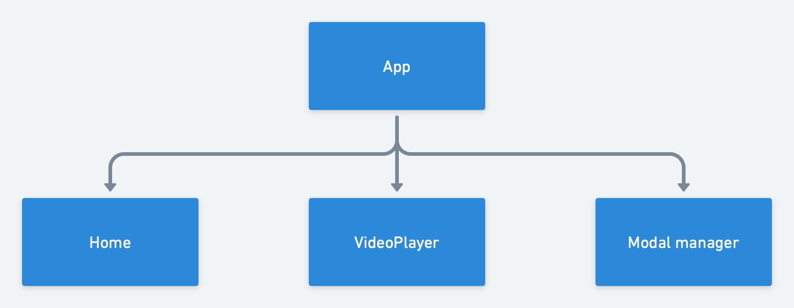
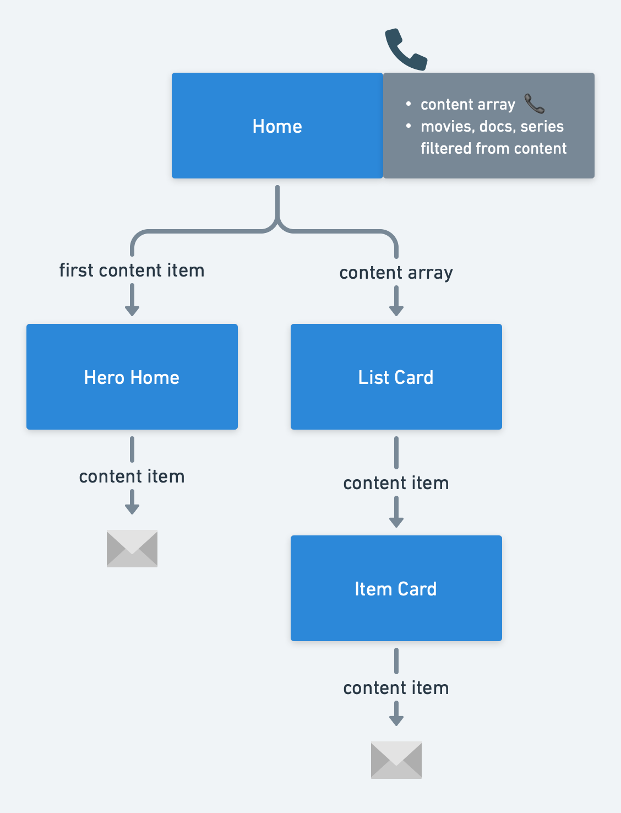
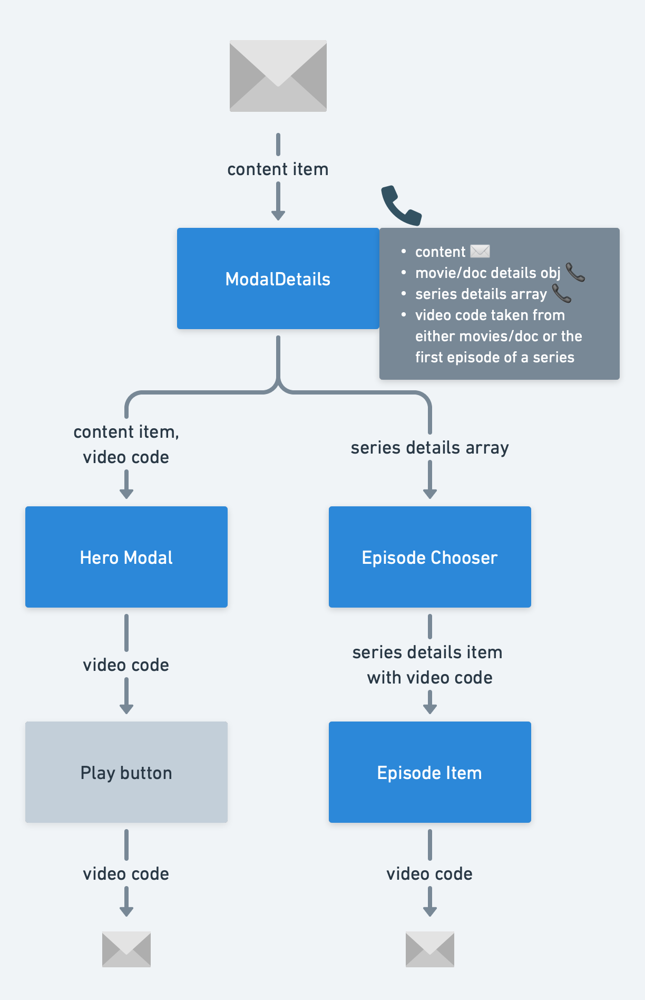
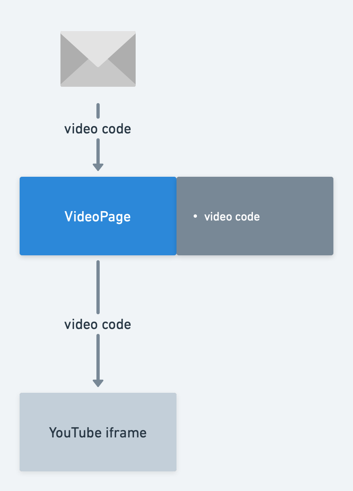

# Natflix

The frontend for project #5 in the Novare Java Course.

# About

It has 2 user roles

1. Admin
2. Customer

Both can login from the same login page.
Admin cannot be added from the website.
Customers can be registered from this website.
It must be connected to a backend to run propertly.

Admin can add documentaries, movies and tv-series with details and images.
Tv series also has episodes.

# Installation

#0 Clone the repository
#0 Open a terminal and type `npm install` inside the repository folder
#0 Run `npm start` to open the project in `localhost:3000`

# Organization

This is a complex project, thus here are some hierarchy diagrams to understand the project structure.

## Main diagram

The entry point is `App.tsx` it has a browser router for multi-page navigation. Currently it has the Home page and the VideoPlayer page.

In addition, it has a Modal manager to handle modals/popups globally using Content API.

## Home page

The home page has a hero header that showcases the first item and also filters the content by movies, series, or documentaries.

# Modal details

Once the user clicks on the more info button or item card, the modal manager opens this specific component to display the complementary information.

Here the user can click on the play button to play the movie or documentary. If the user selected an tv-series, then the play button will play the first epidode of the first season.

If is a tv-series, the user can click on the dropdown menu to filter epidodes by season and then click on any episode to watch it.

## Video page

The video page takes the video code sent from the play button or episode item inside the modal detail and opens a YouTube video corresponding to the video code.

## Updated complete diagram

https://whimsical.com/backend-course-2-WwLheHGeEeijTauPEfw5Z

# Tech stack

## Frontend

- Webpack: The bundler that compiles and handle the different files on the project. All its configuration is created automatically when we started the project using the `npx create-react-app --typescript` template.
- React v18: Our framework to build the User Inteface. We are coding using functional components to break the app down into smaller pieces and using React's Context API to handle global state management.
- TypeScript v4: Our coding language in the frontend to write the logic. Used primarily to enable strong data typing in the frontend by using interfaces and ennumerators.
- CSS v3: Pure CSS without pre-proccesors like SASS, post-processors like PostCSS, or even frameworks like Bootstrap. The intention is to avoid adding additional setup steps just for the graphic design.

## Dependencies

- Node.js v18.12.1 (LTS): To run the commands `npm install` and `npm run` to install the frontend dependencies listed above in the tech stack and run the frontend in your computer.

## Backend

Backend code can be found at below link
https://github.com/aggarrohit/Natflix-Backend
